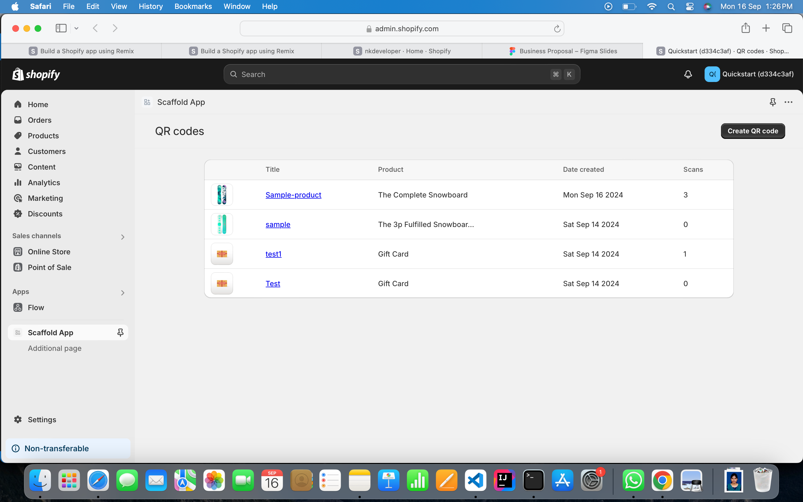
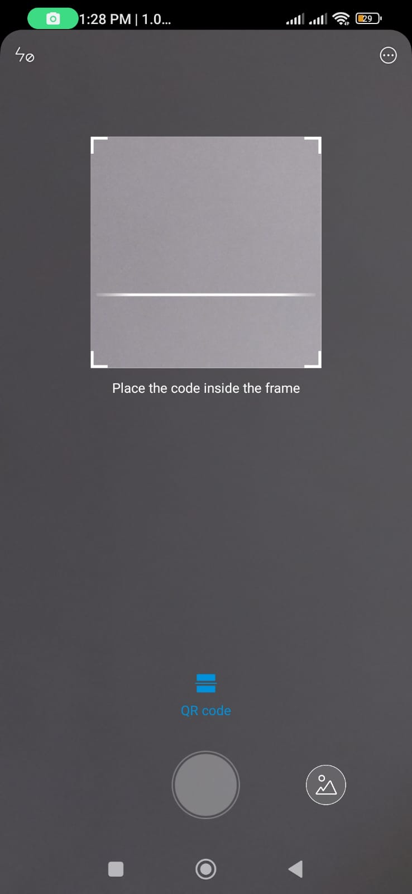
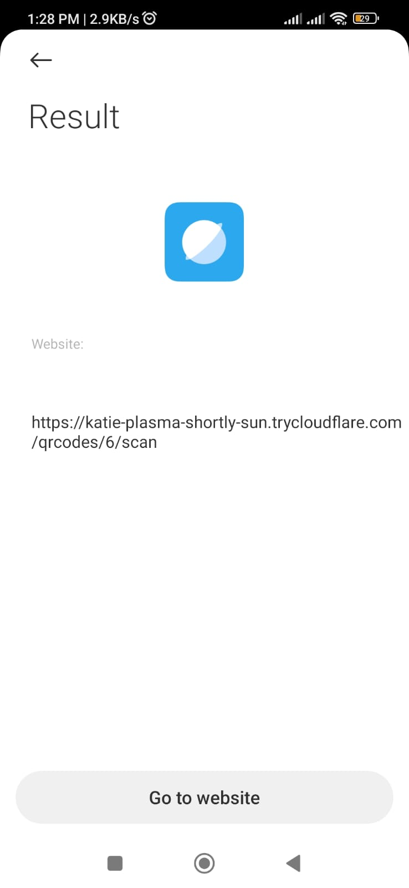
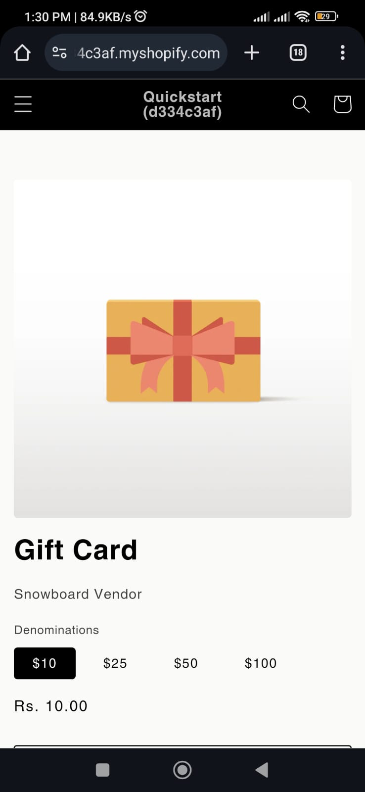

# Shopify-ScaffoldApp

1. Info :

        This is a Shopify app to generate qr codes for the product. When the user scans the qr code, he/she will be redirected to the destination url, which is the product info. Also this app keeps in count of the number of times the product qr is scanned.

2. Screenshots : 

    In the beginning, there will be an emty dashboard which will ask the user to create qr codes for the products using CREATE QR. After creating some of the QRs for the product, the dashboard looks like below.

    

    If wanted to create a qr code for a new product, the qr code generation window will appear on clicking the create qr from dashboard. It asks following details as shown in below screen.

    
    
    

    Once the product details are entered and save button is clicked, the qr code is generated and ready to scan.

    

    Open scanner from a device and scan the image.

    

    The scanned qr shows up an website link, which is the destination url.

    

    After redirecting to the website, the user will be able to view the product info and purchase order in the destination url.
    
    